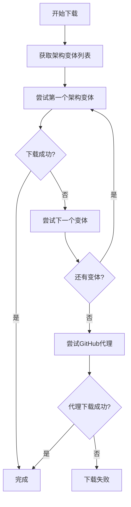

# 🏗️ ARM64/AArch64 架构支持和智能下载系统

## 概述

本配置系统现在完全支持ARM64/AArch64架构，并实现了智能的架构检测和回退机制，解决了不同项目对ARM64架构命名不统一的问题。

## 🔧 核心功能

### 1. 智能架构检测

```bash
# 检测当前系统架构
get_cpu_arch
# 输出: aarch64, x86_64, armv7, i386 等

# 获取架构的所有变体
get_arch_variants
# ARM64输出: aarch64 arm64 aarch64-unknown-linux-gnu aarch64-unknown-linux-musl aarch64-apple-darwin arm64-v8a

# 获取特定架构的变体
get_arch_variants x86_64
# 输出: x86_64 amd64 x86_64-unknown-linux-gnu x86_64-unknown-linux-musl x86_64-apple-darwin
```

### 2. 智能下载回退机制

```bash
# 自动尝试多种架构命名
download_with_arch_fallback \
  "https://github.com/user/tool/releases/download/v1.0/tool-{ARCH}.tar.gz" \
  "/tmp/tool.tar.gz" \
  "mytool"

# 完整的智能下载
smart_download_tool "ripgrep" "BurntSushi/ripgrep" "14.1.1" \
  "ripgrep-{VERSION}-{ARCH}-unknown-linux-musl.tar.gz" "/tmp"
```

## 🎯 支持的架构命名模式

### ARM64/AArch64 变体
- `aarch64` - 标准Linux命名
- `arm64` - GitHub Actions、Docker、macOS命名
- `aarch64-unknown-linux-gnu` - Rust target triple
- `aarch64-unknown-linux-musl` - Rust musl target
- `aarch64-apple-darwin` - macOS ARM64
- `arm64-v8a` - Android ARM64

### x86_64 变体
- `x86_64` - 标准Linux命名
- `amd64` - Debian、Docker命名
- `x86_64-unknown-linux-gnu` - Rust target triple
- `x86_64-unknown-linux-musl` - Rust musl target
- `x86_64-apple-darwin` - macOS x86_64

## 📊 不同项目的命名规范

### Rust项目 (ripgrep, fd, eza, bat)
```
ripgrep-14.1.1-aarch64-unknown-linux-musl.tar.gz
fd-v8.7.0-aarch64-unknown-linux-gnu.tar.gz
eza_aarch64-unknown-linux-gnu.tar.gz
bat-v0.24.0-aarch64-unknown-linux-musl.tar.gz
```

### Go项目 (lazygit, gh)
```
lazygit_0.40.2_Linux_arm64.tar.gz
gh_2.40.1_linux_arm64.tar.gz
```

### C/C++项目
```
cmake-3.28.0-linux-aarch64.tar.gz
ninja-linux-aarch64.zip
```

### Node.js项目
```
node-v20.10.0-linux-arm64.tar.xz
```

## 🚀 使用示例

### 基本架构检测
```bash
# 测试架构检测功能
test-arch

# 查看架构命名模式
show-arch

# 演示智能下载
demo-download
```

### 智能安装工具
```bash
# 使用智能安装系统（优先使用）
install_smart_tool ripgrep

# 使用智能下载回退
install_modern_tools_by_download

# 手动智能下载
smart_download_tool "ripgrep" "BurntSushi/ripgrep" "14.1.1" \
  "ripgrep-{VERSION}-{ARCH}-unknown-linux-musl.tar.gz" "/tmp"
```

## 🔄 回退机制流程



## 📝 实际应用场景

### 1. ARM64 设备（Apple Silicon Mac、树莓派、ARM服务器）
系统会自动尝试：
- `aarch64-unknown-linux-gnu`
- `arm64`
- `aarch64`
- `aarch64-apple-darwin`（macOS）

### 2. x86_64 设备
系统会自动尝试：
- `x86_64-unknown-linux-gnu`
- `amd64`
- `x86_64`

### 3. 网络问题回退
- 首先尝试官方GitHub链接
- 如果失败，自动使用GitHub代理 (`ghproxy.dengqi.org`)
- 每个架构变体都会尝试两种下载方式

## 🛠️ 开发者指南

### 添加新工具支持
```bash
# 在tool_patterns中添加新工具
declare -A tool_patterns=(
    ["your-tool"]="owner/repo|tool-{VERSION}-{ARCH}.tar.gz"
)
```

### 自定义架构变体
```bash
# 为特殊项目添加自定义架构映射
case "$base_arch" in
    "custom_arch")
        echo "custom1 custom2 custom3"
        ;;
esac
```

## 🎉 优势

1. **完全自动化** - 无需手动指定架构
2. **高成功率** - 多种命名方式回退
3. **网络容错** - GitHub代理回退
4. **统一接口** - 所有工具使用相同的下载机制
5. **详细日志** - 清晰的下载进度和错误信息
6. **跨平台** - 支持Linux、macOS、多种ARM设备

这个系统解决了ARM64架构软件安装的痛点，让在任何架构的设备上安装现代命令行工具变得简单可靠！